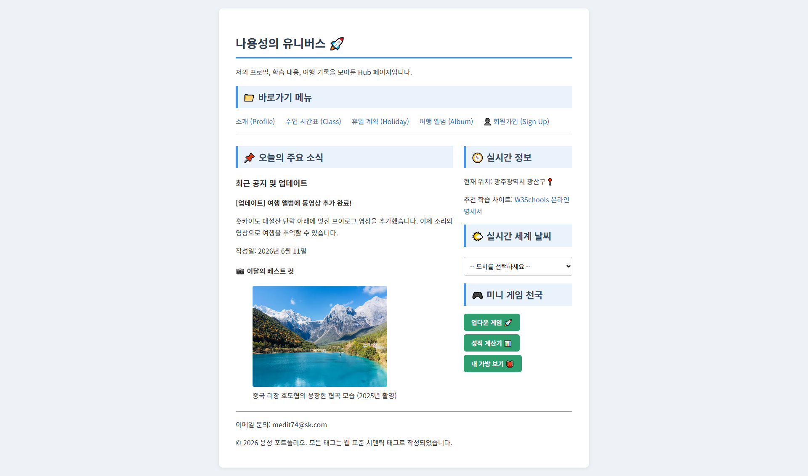
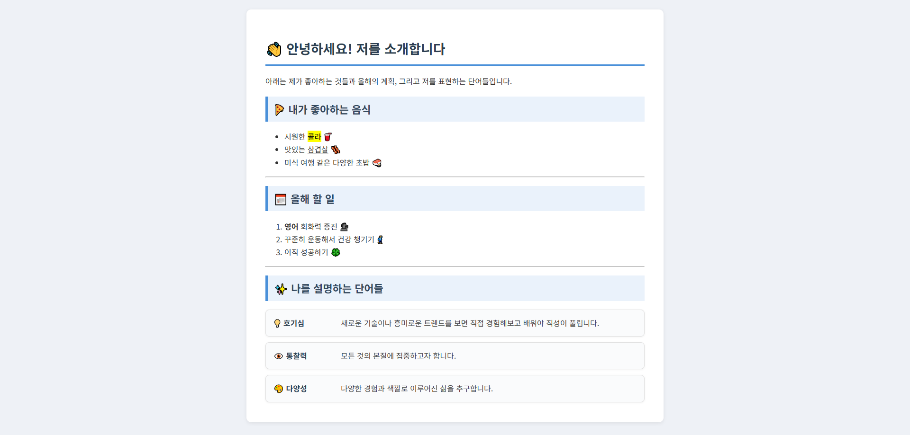
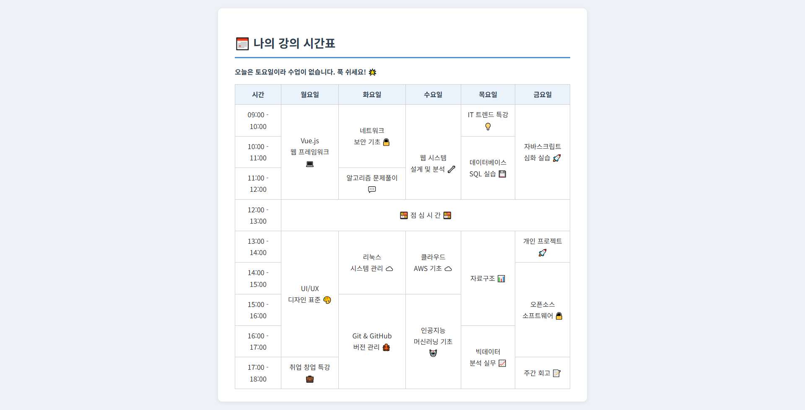
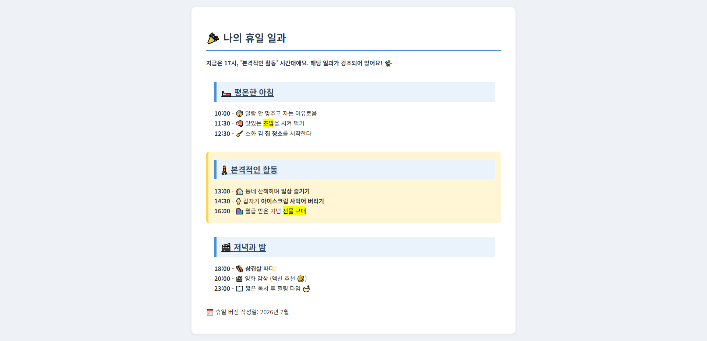
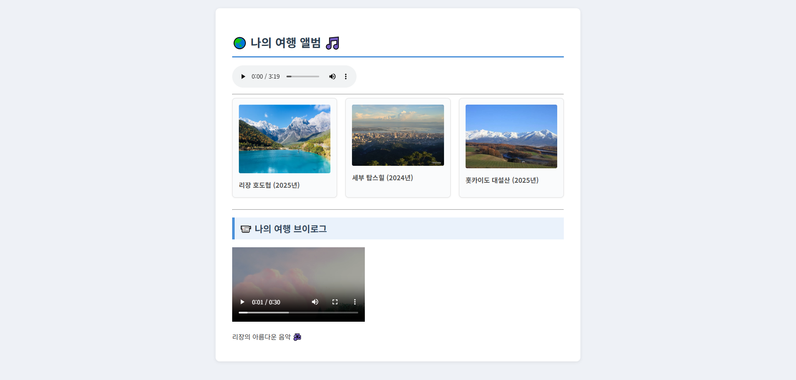
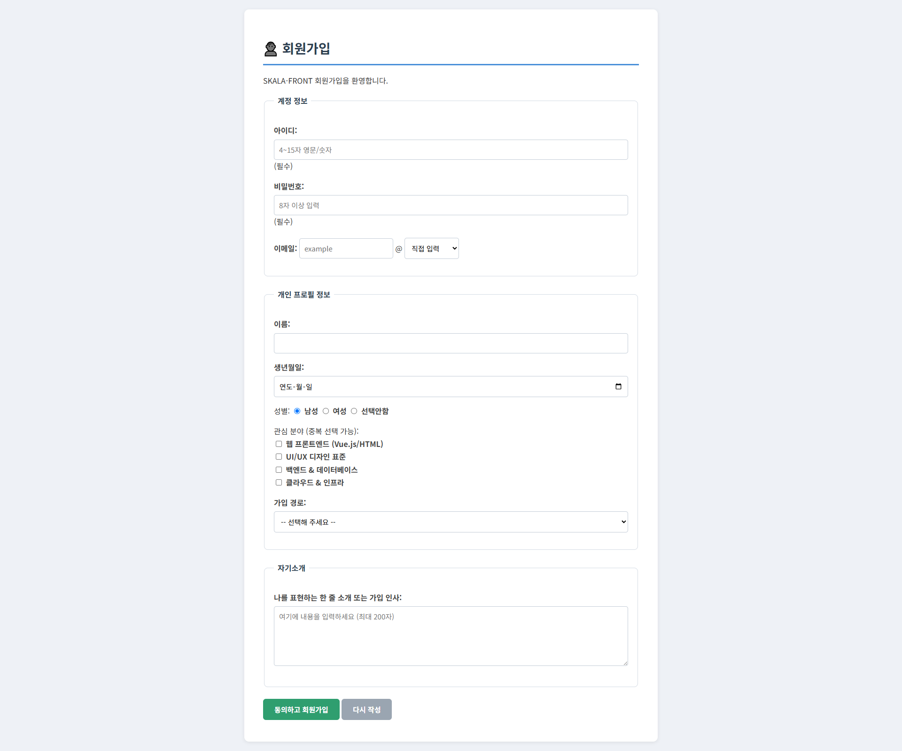
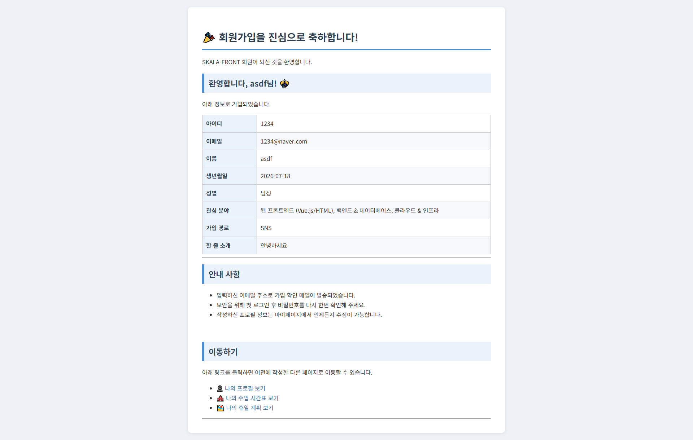

# skala-front

SKALA 교육 과정에서 진행한 프론트엔드(HTML/CSS/JavaScript) 기초 실습 모음입니다.
하나의 개인 포털 사이트를 만들어 가면서 배운 내용을 정리했고, 수업에서 다룬 요구사항 외에
앞에서 만든 페이지에 나중에 배운 내용을 되돌려 적용하는 식으로 조금씩 살을 붙였습니다.

## 실행 방법

`type="module"` 스크립트가 있어 `file://` 로 열면 CORS 때문에 막힙니다.
VS Code의 **Live Server** 확장으로 실행해 주세요.

1. 이 저장소를 클론/다운로드
2. VS Code에서 열기
3. `html/index.html` 우클릭 → **Open with Live Server**
4. 브라우저에서 `http://127.0.0.1:5500/html/index.html` 로 접속

> index.html이 `html/` 폴더 안에 있어서 주소에 `/html/` 이 들어갑니다.

## 폴더 구조

```
skala-front/
├── html/       페이지들 (index가 허브)
├── css/
│   └── style.css   전 페이지 공용 스타일
├── script/     페이지별 JavaScript
└── docs/
    └── screenshots/   README용 화면 캡처
```

## 페이지 소개

### 🚀 index — 허브 페이지
프로필·시간표·여행기록으로 가는 바로가기 허브. 우측에 실시간 세계 날씨(Open-Meteo API)와
미니 게임(업다운 / 성적 계산기 / 내 가방)이 있습니다.



### 👋 myProfile — 자기소개
좋아하는 것, 올해 할 일, 나를 설명하는 단어들. 마지막 정의목록은 카드 형태로 정렬하고
마우스를 올리면 살짝 떠오르게 했습니다.



### 📅 myClass — 강의 시간표
`rowspan`/`colspan`으로 병합한 시간표. 접속한 날의 요일 열이 자동으로 강조됩니다.



### 🎉 myHoliday — 휴일 일과
아침 / 활동 / 저녁·밤 세 구획으로 나눈 하루 일과. 현재 시각대에 해당하는 구획이 강조됩니다.



### 🧳 myTrip — 여행 앨범
사진·영상·음악을 넣은 여행 기록. 카드를 3열 그리드로 배치했습니다.



### 👤 signUp / signUpResult — 회원가입
폼 요소 실습. 제출할 때 JavaScript로 아이디·비밀번호 규칙을 검사하고,
통과하면 결과 페이지에서 입력한 값을 읽어 환영 인사와 요약표로 보여줍니다.





## 기본 요구사항 외에 더 해본 것

과제 스펙만 채우기보다, 앞에서 만든 페이지에 나중에 배운 CSS/JS를 되돌려 적용해 봤습니다.

- **signUpResult** — 고정 안내 페이지였던 것을, 앞 폼에서 URL로 넘어온 입력값을 직접 파싱해
  "환영합니다, ○○○님!" 인사와 가입 정보 요약표를 보여주도록 만들었습니다.
- **성적 계산기 / 내 가방** — `alert` 창으로만 띄우던 결과를 화면에 표(성적표)와
  카드 리스트로 그리도록 바꿨습니다. (내 가방은 물품 총개수 합계도 추가)
- **업다운 게임** — `prompt`/`alert` 반복 대신 입력칸과 버튼을 두고, 클릭할 때마다
  Up/Down 힌트·시도 기록·남은 기회(7번 제한)를 화면에 갱신하게 했습니다.
- **회원가입 폼** — 제출할 때 JavaScript로 아이디(4~15자 영문/숫자)·비밀번호(8자 이상) 등을
  검사해서, 통과하지 못하면 다음 페이지로 넘어가지 않도록 했습니다.
- **강의 시간표** — 접속한 날의 요일 열을 자동으로 강조하고, 화면이 좁으면 표가 가로 스크롤됩니다.
- **자기소개** — 정의목록을 Grid 2열 카드로 정렬하고 마우스 오버 효과를 넣었습니다.
- **휴일 일과** — 하루를 `<section>`으로 나누고, 현재 시각에 해당하는 구획을 강조합니다.
- **실시간 날씨** — 데이터를 불러오는 동안 `@keyframes`로 만든 로딩 스피너가 돌아갑니다.

## 다룬 내용

- **HTML**: 텍스트/목록/표(병합) 태그, 폼 요소, 미디어 태그, 시맨틱 태그(nav/main/aside/section)
- **CSS**: 테마·박스모델·폼 스타일, Flexbox·Grid, 반응형(`@media`), transition·animation(`@keyframes`)
- **JavaScript**: 반복문·배열·객체, DOM 조작(`getElementById`·`addEventListener`·`innerHTML`),
  `fetch` + `async/await`, 모듈 `export`/`import`
